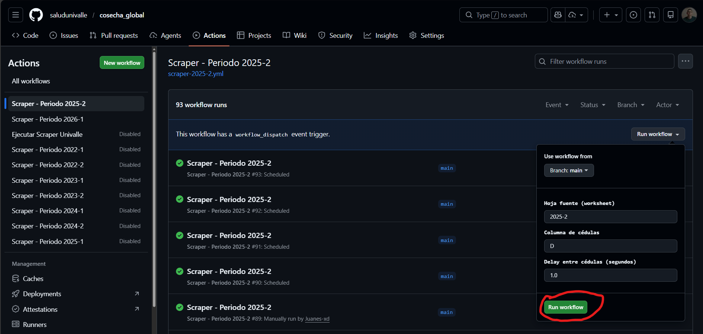

# Sistema de Gestión de Asignaciones Académicas

Sistema para la gestión y consulta de asignaciones académicas de docentes de la Universidad del Valle.

## 🚀 Instalación y Configuración

### Prerrequisitos

- **Node.js 18+** y npm
- **Python 3.8+** (para el scraper)
- **Google Sheets API** configurada (para el scraper)

### 1. Aplicativo Web (Next.js)

```bash
# Instalar dependencias
npm install

# Configurar variables de entorno (si es necesario)
# Crear archivo .env con las variables requeridas

# Ejecutar en desarrollo
npm run dev
```

El aplicativo estará disponible en `http://localhost:3000`

### 2. Scraper (Python)

#### Instalación

```bash
# Navegar a la carpeta del scraper
cd scraper

# Crear entorno virtual (recomendado)
python -m venv venv

# Activar entorno virtual
# Windows:
venv\Scripts\activate
# Linux/Mac:
source venv/bin/activate

# Instalar dependencias
pip install -r requirements.txt
```

#### Configuración de Variables de Entorno

Crear un archivo `.env` en la raíz del proyecto o configurar las siguientes variables:

```bash
# Credenciales de Google Sheets (JSON como string)
GOOGLE_CREDENTIALS=service_accoun

# URLs de las hojas de Google Sheets
SHEET_URL_SOURCE="https://docs.google.com/spreadsheets/d/..."
SHEET_URL_TARGET="https://docs.google.com/spreadsheets/d/..."

# Período objetivo a procesar (formato: YYYY-T, ej: "2026-1")
TARGET_PERIOD="2026-1"
```

#### Variables Opcionales

```bash
# Configuración del scraper
UNIVALLE_BASE_URL="https://proxse26.univalle.edu.co..."
REQUEST_TIMEOUT="30"
REQUEST_MAX_RETRIES="3"
REQUEST_RETRY_DELAY="2"

# Logging
LOG_LEVEL="INFO"
LOG_FILE="scraper.log"
```

#### Ejecución

```bash
# Ejecutar scraper con todas las opciones
python main.py --modo completo \
  --source-sheet-url "$SHEET_URL_SOURCE" \
  --target-sheet-url "$SHEET_URL_TARGET" \
  --target-period "$TARGET_PERIOD" \
  --source-worksheet "2025-2" \
  --source-column "D" \
  --delay-cedulas 1.0
```

O usando Github Actions

#### Corrección de fallo en ejecución

Ir al repositorio del proyecto, acceder a la pestaña de Actions, en la parte izquierda estaran los workflows(Automatizaciones) de la cosecha, ingresar a 2025-2 y 2026-1 y en cada uno ir a la parte derecha donde está la opcion Run workflow, dar click y se abre una pequeña ventana, dar click en el boton verde de Run workflow y esperar aproximandamente 23 minutos a que se termine de ejecutar la automatización.

